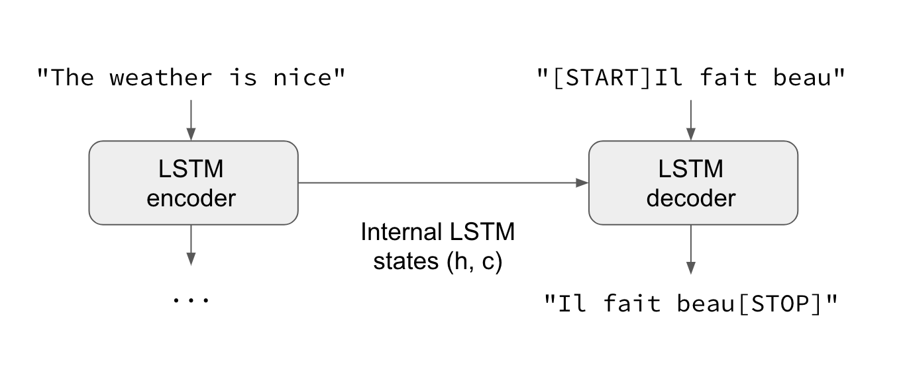
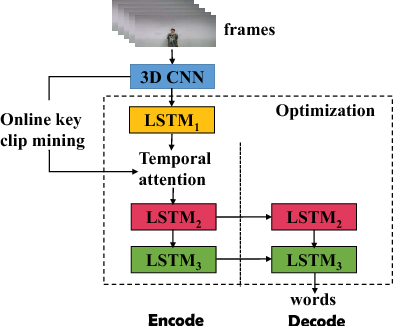
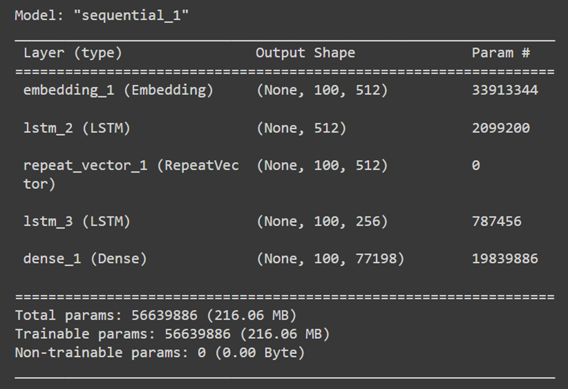

# Multilingual Language Translator

A comprehensive Python-based project that combines speech recognition and language translation. This project allows users to input spoken sentences, recognize the speech, and translate it into a desired language using Google Translate API.

## Project Overview

The Multilingual Language Translator is designed to recognize spoken sentences and translate them into various languages using the Google Translate API. It utilizes `speech_recognition` for capturing speech and `googletrans` for translation.

## Features

- **Speech Recognition:** Convert spoken words into text.
- **Language Detection:** Automatically detect the language of the input text.
- **Translation:** Translate text into any desired language supported by Google Translate.
- **Text-to-Speech:** Convert the translated text back into speech for the user.

## Installation

To get started with the project, ensure you have Python installed on your system. Then, install the necessary dependencies using pip:

```bash
pip install googletrans==3.1.0a0 speechrecognition pyttsx3
```

## Usage

### Speech Recognition and Translation

1. **Run the `speech_re.py` script**:
    ```python
    python speech_re.py
    ```
    - The script will listen to your speech, recognize it, and print the recognized text.
    - It will then prompt you to select the language code for translation and output the translated text.

2. **Run the `tri.py` script**:
    ```python
    python tri.py
    ```
    - This script will prompt you to enter a sentence and the target language code for translation.
    - It will detect the language of the entered sentence and print the translated text.



## Code Explanation

### `speech_re.py`

This script captures spoken words through the microphone, recognizes the speech, and translates it to the desired language.

```python
import googletrans # googletrans==3.1.0a0
import speech_recognition as sr
import pyttsx3

engine = pyttsx3.init()
recognizer = sr.Recognizer()

with sr.Microphone() as source:
    print("Wait for calibrations")
    recognizer.adjust_for_ambient_noise(source, 1)
    print("Start speaking")
    audio = recognizer.listen(source)
    print("Recorded successfully")
    speech = recognizer.recognize_google(audio)
    speech = speech.lower()
    print(speech)

def trans():
    print("Translating")
    print(googletrans.LANGCODES)
    language = input("Type the translation language code: ").lower()
    translator = googletrans.Translator()
    translation = translator.translate(text=speech, dest=language)
    print("Translation: ", translation.text)
    engine.setProperty("rate", 120)
    engine.say(translation.pronunciation)
    engine.runAndWait()

trans()
```

### `tri.py`

This script allows the user to manually input text and choose a target language for translation.

```python
from langdetect import detect
import googletrans

sentence = input("Enter the sentence: ")
print(detect(sentence))

language = input("Type the translation language code: ").lower()

translator = googletrans.Translator()
translation = translator.translate(text=sentence, dest=language)
print("Translation: ", translation.text)
print(detect(translation.text))
```




## Contributors

- **Yuvraj Singh Chowdhary**
  - [LinkedIn](https://www.linkedin.com/in/yuvraj-singh-chowdhary/)
  - [GitHub](https://github.com/chowdhary19)

